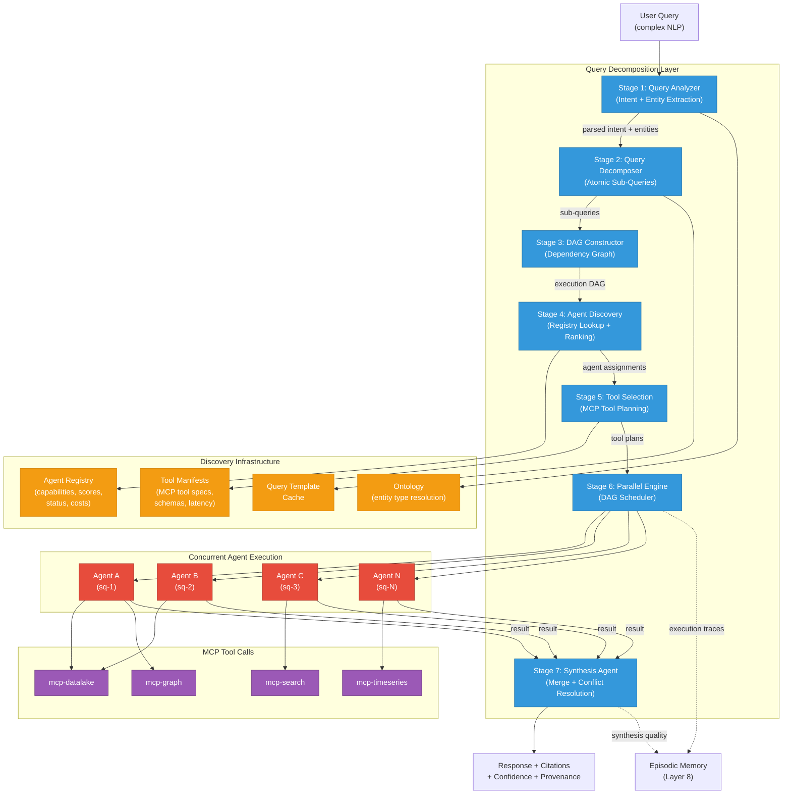

# Multi-Agentic AI Architecture with Self-Rebuilding Knowledge Graphs & Dynamic Ontology Layers

## 1. Guiding Principles

| Principle | Rationale |
|---|---|
| **Platform-agnostic** | No lock-in to Azure, AWS, or GCP; swap components freely |
| **Medallion data progression** | Bronze → Silver → Gold → Adaptive Gold |
| **Knowledge graph as first-class citizen** | Agents reason over relationships, not just documents |
| **Ontology is alive** | AI continuously refines the schema; humans approve |
| **Agents are composable** | Each agent has a single responsibility; orchestration handles coordination |
| **MCP as the universal tool boundary** | All external system access flows through governed MCP servers |
| **Real-time + batch coexistence** | Time-series data streams alongside batch-curated knowledge |
| **Agents never stop learning** | Every interaction is a training signal; every failure is a curriculum |
| **Evaluate continuously, not periodically** | Online + offline evaluation loops ensure agents improve or get demoted in real time |

---

## 2. End-to-End Architecture (Layer by Layer)

### Layer 0 — Data Sources

```
+---------------------------+---------------------------+---------------------------+
|   Structured Sources      |   Unstructured Sources    |   Real-Time Streams       |
|   (ERP, CRM, RDBMS)      |   (PDFs, Docs, Wikis)     |   (IoT, Sensors, Logs)    |
+---------------------------+---------------------------+---------------------------+
```

- **Structured**: Relational DBs, APIs, SaaS exports (JSON/CSV)
- **Unstructured**: Documents, emails, Slack/Teams transcripts, images
- **Real-Time Time-Series**: Kafka/Pulsar topics carrying sensor telemetry, clickstreams, financial ticks, operational metrics

---

### Layer 1 — Ingestion & Streaming Fabric

| Component | Role |
|---|---|
| **Change Data Capture (CDC)** | Debezium or equivalent; streams row-level changes from transactional DBs |
| **Event Streaming Bus** | Kafka / Pulsar / Redpanda; durable, ordered, replayable event backbone |
| **Batch Ingestors** | Scheduled pulls for document stores, SaaS APIs, file drops |
| **Schema Registry** | Avro/Protobuf registry; enforces contract between producers and consumers |
| **Stream Processors** | Flink / Spark Structured Streaming; windowed aggregations, anomaly flags on time-series |

**Real-time time-series pipeline detail:**

```
Sensor/IoT --> Kafka Topic (raw_telemetry) --> Flink (window + enrich) --> Kafka Topic (enriched_telemetry)
                                                                      --> Bronze Lake (append-only Parquet/Delta)
```

---

### Layer 2 — Medallion Data Lake (Unified Storage)

All storage in **Delta/Iceberg format** on object storage (S3, GCS, MinIO, ADLS — your choice).

| Tier | Purpose | Time-Series Specific |
|---|---|---|
| **Bronze** | Immutable raw ingestion; full lineage | Raw telemetry events, append-only partitioned by time |
| **Silver** | Cleaned, deduplicated, schema-enforced, joined | Gap-filled, resampled, anomaly-tagged time-series; normalized entity tables |
| **Gold (Static)** | Business KPIs, semantic models, certified datasets | Pre-aggregated rollups (hourly, daily), SLA metrics, trend tables |
| **Adaptive Gold** | Agent-generated curated tables driven by usage telemetry | Frequently-queried aggregation patterns materialized on demand; spec files in Git |

**Key rule**: Agents ground on **Silver** for reasoning (retains relationships and granularity). Agents report from **Gold** for dashboards and summaries.

---

### Layer 3 — Knowledge Graph & Dynamic Ontology Engine

This is the differentiating layer. Traditional architectures stop at vector search; this architecture treats a **knowledge graph + evolving ontology** as the primary reasoning substrate.

#### 3a. Knowledge Graph Store

- **Graph Database**: Neo4j / Amazon Neptune / JanusGraph / NebulaGraph
- **Triple Store** (optional for formal ontology): Apache Jena / Stardog / Oxigraph
- **Contents**: Entities, relationships, properties, provenance metadata, confidence scores, temporal validity windows

#### 3b. Self-Rebuilding Pipeline

```
 Silver Data
     |
     v
 +--------------------------+
 | Entity Extraction Agent  |  (NER, relation extraction via LLM + spaCy/GLiNER)
 +--------------------------+
     |
     v
 +--------------------------+
 | Entity Resolution Agent  |  (deduplication, co-reference, fuzzy matching)
 +--------------------------+
     |
     v
 +--------------------------+
 | Relationship Inference   |  (LLM-based + rule-based link prediction)
 | Agent                    |
 +--------------------------+
     |
     v
 +--------------------------+
 | Graph Merge & Conflict   |  (CRDT-style merge; human-in-the-loop for conflicts)
 | Resolution Agent         |
 +--------------------------+
     |
     v
 Knowledge Graph Store (versioned, temporal)
```

**Self-rebuilding mechanics:**

- **Continuous**: Every new Silver record triggers entity extraction → graph update
- **Periodic**: Full re-indexing sweep catches drift, removes stale nodes, re-scores confidence
- **Event-driven**: Schema changes in the Schema Registry trigger ontology review
- **Feedback loop**: When agents fail to answer a query, the gap is logged; the Ontology Evolution Agent investigates and proposes schema extensions

#### 3c. Dynamic Ontology Layer

The ontology is **not static YAML/OWL managed by humans alone**. It evolves through an AI-assisted lifecycle:

| Phase | Mechanism |
|---|---|
| **Discovery** | Ontology Discovery Agent scans Silver data + query logs to propose new entity types, relationships, and attributes |
| **Proposal** | Changes are staged as a Pull Request to an ontology Git repo (OWL/SHACL/JSON-LD) |
| **Validation** | Automated consistency checks (SHACL constraints, reasoning tests); optional human review |
| **Deployment** | Approved changes are applied to the graph store schema and propagated to all indexers |
| **Deprecation** | Unused or low-confidence concepts are flagged for removal after a cooling period |

**Ontology-aware indexing**: The ontology drives how new data is chunked, embedded, and indexed. When a new entity type appears (e.g., "Maintenance Window"), the indexing pipeline automatically creates appropriate embeddings and graph nodes.

---

### Layer 4 — Retrieval & Search Infrastructure

| Component | Purpose |
|---|---|
| **Vector Search Index** | Embeddings over Silver documents + Gold summaries (Qdrant / Weaviate / Milvus / pgvector) |
| **Full-Text Search** | Elasticsearch / OpenSearch for keyword + BM25 |
| **Graph Traversal API** | Cypher / Gremlin queries for multi-hop reasoning |
| **Time-Series Index** | TimescaleDB / InfluxDB / QuestDB for sub-second range queries on enriched telemetry |
| **Hybrid Retriever** | Fusion layer that combines vector, keyword, graph, and time-series results with reciprocal rank fusion |

**Agentic retrieval** = the Retrieval Agent decides *which* indexes to query, decomposes the question, runs parallel sub-queries, and reconciles results before passing to the reasoning agent.

---

### Layer 5 — Multi-Agent Orchestration

#### Agent Taxonomy

| Agent | Responsibility | Tools (via MCP) |
|---|---|---|
| **Orchestrator Agent** | Manages the full query lifecycle; coordinates all 7 stages of the decomposition pipeline | Agent registry, DAG scheduler, execution context |
| **Query Analyzer Agent** | Parses raw NLP into structured intent, extracts entities, resolves against ontology | Ontology API, entity linker, query template cache |
| **Query Decomposer Agent** | Breaks complex queries into atomic sub-queries; builds dependency DAG | Decomposition prompt library, template cache, DAG constructor |
| **Retrieval Agent** | Agentic RAG; multi-source search, citation grounding | Vector index, graph API, full-text, time-series |
| **Reasoning Agent** | Multi-step inference, chain-of-thought, plan generation | Knowledge graph read, calculator, code interpreter |
| **Action Agent** | Executes write operations (create ticket, update record) | MCP write servers (CRM, ITSM, ERP) |
| **Curation Agent** | Builds Adaptive Gold tables, materializes frequent patterns | Data lake write, Purview/catalog registration |
| **KG Builder Agent** | Entity extraction, resolution, graph merge (Layer 3b) | NLP pipeline, graph write API |
| **Ontology Evolution Agent** | Proposes and validates schema changes | Ontology Git repo, SHACL validator, graph schema API |
| **Monitor Agent** | Watches agent performance, data freshness, drift detection | Metrics store, alerting API |
| **Time-Series Analyst Agent** | Anomaly detection, forecasting, trend explanation on streaming data | Time-series index, Flink query API, statistical libraries |
| **Evaluator Agent** | Scores every response for relevance, groundedness, safety; maintains scorecards | Episodic memory, LLM-as-judge, guardrails |
| **Prompt Evolution Agent** | Analyzes low-scoring episodes; rewrites and A/B tests agent prompts | Episodic memory, prompt registry, A/B test framework |
| **Retrieval Eval Agent** | Measures retrieval recall/precision; tunes chunking, re-ranking, query decomposition | Episodic memory, retrieval config store, annotated relevance sets |

#### Query Decomposition & Intelligent Routing Layer

Complex natural language queries rarely map to a single agent or a single tool call. A user might ask *"Compare our Q4 revenue with last year, identify which product lines declined, check if any related support tickets spiked, and draft an executive summary"* — that's at least four distinct sub-tasks spanning structured data, time-series, knowledge graph traversal, document retrieval, and generation. The **Query Decomposition Layer** breaks this apart, plans an execution graph, discovers the right agents, selects the right tools, and orchestrates everything.

##### Stage 1 — Intent Parsing & Entity Extraction

The raw user query enters a lightweight **Query Analyzer** (an LLM call with a structured output schema). It produces:

```json
{
  "raw_query": "Compare our Q4 revenue with last year, identify which product lines declined, check if any related support tickets spiked, and draft an executive summary",
  "parsed_intent": {
    "primary_intent": "multi_part_analysis",
    "sub_intents": ["comparison", "trend_identification", "correlation", "generation"],
    "temporal_scope": { "current": "2025-Q4", "comparison": "2024-Q4" },
    "confidence": 0.93
  },
  "extracted_entities": [
    { "text": "Q4 revenue", "type": "Metric", "resolved_id": "metric:quarterly_revenue" },
    { "text": "product lines", "type": "EntityClass", "ontology_type": "ProductLine" },
    { "text": "support tickets", "type": "EntityClass", "ontology_type": "SupportTicket" }
  ],
  "constraints": {
    "output_format": "executive_summary",
    "comparison_type": "year_over_year"
  }
}
```

**Key design choice**: The Query Analyzer consults the **ontology** (Layer 3c) to resolve entity types. When the user says "product lines," the analyzer maps it to the ontology type `ProductLine`, which tells downstream stages exactly which graph nodes and lake tables are relevant.

##### Stage 2 — Atomic Decomposition

The parsed intent feeds into the **Query Decomposer**, which breaks the query into **atomic sub-queries** — each one answerable by a single agent in a single reasoning pass.

```json
{
  "decomposition_id": "dec-uuid-001",
  "parent_query": "Compare our Q4 revenue with last year...",
  "sub_queries": [
    {
      "sq_id": "sq-1",
      "text": "What was total revenue in Q4 2025, broken down by product line?",
      "type": "structured_lookup",
      "entities": ["metric:quarterly_revenue", "ontology:ProductLine"],
      "temporal": "2025-Q4",
      "dependencies": []
    },
    {
      "sq_id": "sq-2",
      "text": "What was total revenue in Q4 2024, broken down by product line?",
      "type": "structured_lookup",
      "entities": ["metric:quarterly_revenue", "ontology:ProductLine"],
      "temporal": "2024-Q4",
      "dependencies": []
    },
    {
      "sq_id": "sq-3",
      "text": "Which product lines show a revenue decline when comparing Q4 2025 to Q4 2024?",
      "type": "comparison_analysis",
      "entities": ["ontology:ProductLine"],
      "dependencies": ["sq-1", "sq-2"]
    },
    {
      "sq_id": "sq-4",
      "text": "For each declining product line, did support ticket volume spike during Q4 2025?",
      "type": "correlation_analysis",
      "entities": ["ontology:ProductLine", "ontology:SupportTicket"],
      "dependencies": ["sq-3"]
    },
    {
      "sq_id": "sq-5",
      "text": "Draft an executive summary of the revenue comparison, declining product lines, and support ticket correlation",
      "type": "generation",
      "dependencies": ["sq-1", "sq-2", "sq-3", "sq-4"]
    }
  ]
}
```

##### Stage 3 — Dependency Graph (DAG) Construction

The decomposer's output is a **directed acyclic graph** where nodes are sub-queries and edges are data dependencies. This determines what can run in parallel vs. what must wait.

```
 ┌──────────────────────────────────────────────────────┐
 │              EXECUTION DAG                            │
 │                                                       │
 │  Level 0 (parallel):                                  │
 │  ┌─────────┐     ┌─────────┐                          │
 │  │  sq-1   │     │  sq-2   │   ← no dependencies,     │
 │  │ Q4 2025 │     │ Q4 2024 │     run in parallel       │
 │  │ revenue │     │ revenue │                           │
 │  └────┬────┘     └────┬────┘                          │
 │       │               │                               │
 │       └───────┬───────┘                               │
 │               │                                       │
 │  Level 1 (sequential):                                │
 │           ┌───┴───┐                                   │
 │           │ sq-3  │   ← depends on sq-1 + sq-2        │
 │           │ YoY   │                                   │
 │           │compare│                                   │
 │           └───┬───┘                                   │
 │               │                                       │
 │  Level 2 (sequential):                                │
 │           ┌───┴───┐                                   │
 │           │ sq-4  │   ← depends on sq-3               │
 │           │ticket │                                   │
 │           │correl.│                                   │
 │           └───┬───┘                                   │
 │               │                                       │
 │  Level 3 (sequential):                                │
 │           ┌───┴───┐                                   │
 │           │ sq-5  │   ← depends on all above          │
 │           │ draft │                                   │
 │           │summary│                                   │
 │           └───────┘                                   │
 └──────────────────────────────────────────────────────┘
```

The **DAG Scheduler** executes level-by-level: all sub-queries at the same level run concurrently; the next level waits until all dependencies are resolved.

##### Stage 4 — Agent Discovery

For each sub-query, the orchestrator must find the **best-suited agent**. This is not hardcoded — it uses a dynamic **Agent Registry** that every agent self-registers into.

**Agent Registry schema:**

```json
{
  "agent_id": "retrieval-agent-v2.3",
  "agent_type": "RetrievalAgent",
  "status": "active",
  "version": "2.3",

  "capabilities": {
    "query_types": ["structured_lookup", "semantic_search", "graph_traversal", "hybrid_search"],
    "entity_types": ["Customer", "Product", "ProductLine", "Order", "SupportTicket"],
    "data_layers": ["silver", "gold", "adaptive_gold"],
    "temporal_support": true,
    "max_context_tokens": 128000
  },

  "performance": {
    "composite_score": 0.88,
    "avg_latency_ms": 450,
    "success_rate": 0.94,
    "last_evaluated": "2026-01-26T08:00:00Z"
  },

  "mcp_tools": [
    { "server": "mcp-datalake", "tools": ["read_table", "query_sql"] },
    { "server": "mcp-search", "tools": ["vector_search", "keyword_search"] },
    { "server": "mcp-graph", "tools": ["cypher_query", "traverse"] }
  ],

  "cost_per_call": { "compute_units": 1.2, "llm_tokens_avg": 4500 }
}
```

**Discovery algorithm:**

```
 For each sub-query sq:
     │
     ├─ 1. FILTER: Find agents whose capabilities.query_types
     │      contains sq.type AND capabilities.entity_types
     │      intersects sq.entities
     │
     ├─ 2. RANK: Score candidates by:
     │      ┌────────────────────────────────────┬──────────┐
     │      │ Factor                             │ Weight   │
     │      ├────────────────────────────────────┼──────────┤
     │      │ Composite score (from scorecard)   │ 0.35     │
     │      │ Query-type specialization match    │ 0.25     │
     │      │ Historical success on similar sq   │ 0.20     │
     │      │ Current load / availability        │ 0.10     │
     │      │ Cost efficiency                    │ 0.10     │
     │      └────────────────────────────────────┴──────────┘
     │
     ├─ 3. SELECT: Pick top-ranked agent
     │      (if score delta between #1 and #2 < threshold,
     │       occasionally route to #2 for exploration / A/B testing)
     │
     └─ 4. FALLBACK: If no agent matches, the Orchestrator either:
            • Attempts the sub-query itself (general-purpose LLM)
            • Logs a capability gap → triggers Skill Acquisition loop (Layer 8)
            • Returns partial results with a "capability not available" flag
```

**Agent Discovery example for the revenue query:**

| Sub-Query | Type | Discovered Agent | Rationale |
|---|---|---|---|
| sq-1: Q4 2025 revenue by product line | `structured_lookup` | Retrieval Agent v2.3 | Highest score for structured lookups; has `mcp-datalake.query_sql` |
| sq-2: Q4 2024 revenue by product line | `structured_lookup` | Retrieval Agent v2.3 | Same agent, same capability |
| sq-3: YoY comparison | `comparison_analysis` | Reasoning Agent v1.8 | Specializes in multi-dataset reasoning; consumes outputs of sq-1 + sq-2 |
| sq-4: Support ticket correlation | `correlation_analysis` | Reasoning Agent v1.8 + Time-Series Analyst v1.2 | Reasoning Agent orchestrates; TS Agent provides ticket volume trends |
| sq-5: Draft executive summary | `generation` | Reasoning Agent v1.8 | Generation capability; receives all prior results as context |

##### Stage 5 — Tool Selection

Once an agent is discovered, it needs to know **which specific MCP tools** to use for its sub-query. Tool selection is a two-step process:

**Step A — Tool Registry lookup:**

Each MCP server publishes a **Tool Manifest** describing its available tools:

```json
{
  "mcp_server": "mcp-datalake",
  "tools": [
    {
      "tool_id": "read_table",
      "description": "Read rows from a Delta/Iceberg table with optional filter and column projection",
      "input_schema": {
        "table": "string (required)",
        "filter": "string (SQL WHERE clause, optional)",
        "columns": "string[] (optional, defaults to all)",
        "limit": "int (optional, default 1000)"
      },
      "output_schema": "array of row objects",
      "data_layers": ["bronze", "silver", "gold", "adaptive_gold"],
      "cost": "low",
      "latency_p95_ms": 200
    },
    {
      "tool_id": "query_sql",
      "description": "Execute a read-only SQL query against the lake's SQL engine",
      "input_schema": {
        "sql": "string (required, SELECT only)",
        "parameters": "object (optional, for parameterized queries)"
      },
      "output_schema": "array of row objects",
      "data_layers": ["silver", "gold", "adaptive_gold"],
      "cost": "medium",
      "latency_p95_ms": 800
    }
  ]
}
```

**Step B — Agent selects tools based on sub-query requirements:**

The assigned agent receives the sub-query plus its available tools and uses an LLM planning step (or a rule-based planner for deterministic sub-queries) to produce a **Tool Execution Plan**:

```json
{
  "sq_id": "sq-1",
  "assigned_agent": "retrieval-agent-v2.3",
  "tool_plan": [
    {
      "step": 1,
      "description": "Resolve ProductLine entities from knowledge graph to get data_refs",
      "tool": "mcp-graph.cypher_query",
      "params": {
        "query": "MATCH (pl:ProductLine) RETURN pl.entity_id, pl.identity_attributes.name, pl.data_refs"
      },
      "output_binding": "$product_lines"
    },
    {
      "step": 2,
      "description": "Fetch Q4 2025 revenue by product line from Gold layer",
      "tool": "mcp-datalake.query_sql",
      "params": {
        "sql": "SELECT product_line, SUM(revenue) as total_revenue FROM gold.finance.quarterly_revenue WHERE quarter = '2025-Q4' GROUP BY product_line ORDER BY total_revenue DESC",
        "parameters": {}
      },
      "output_binding": "$revenue_data",
      "depends_on": ["$product_lines"]
    }
  ]
}
```

**Tool Selection decision matrix:**

| Sub-Query Characteristic | Preferred Tool | Rationale |
|---|---|---|
| Exact lookup by known ID | `mcp-datalake.read_table` | Simple filter, low cost, fast |
| Aggregation / GROUP BY / JOIN | `mcp-datalake.query_sql` | SQL engine handles complex analytics |
| Semantic / fuzzy search | `mcp-search.vector_search` | Embedding-based similarity |
| Multi-hop relationship traversal | `mcp-graph.cypher_query` | Graph DB excels at path queries |
| Time-range with windowing | `mcp-timeseries.range_query` | Optimized for temporal range scans |
| Real-time latest value | `mcp-crm.get_record` or `mcp-telemetry.latest` | Live from source, not lake |
| Write / create / update | `mcp-itsm.create_ticket`, `mcp-crm.update_record` | Action tools with confirmation |

##### Stage 6 — Parallel Execution Engine

The DAG Scheduler executes the plan. This is implemented as an async task runner with structured concurrency:

```
 ┌─────────────────────────────────────────────────────────────────────┐
 │                   DAG EXECUTION ENGINE                               │
 │                                                                      │
 │  Input: Execution DAG + Agent Assignments + Tool Plans               │
 │                                                                      │
 │  for each level in DAG (topological order):                          │
 │      │                                                               │
 │      ├── Dispatch all sub-queries at this level CONCURRENTLY:        │
 │      │    ┌──────────────────────────────────────────────────┐       │
 │      │    │  For each sq at this level:                      │       │
 │      │    │    1. Inject resolved outputs from dependencies  │       │
 │      │    │    2. Send to assigned agent via event bus        │       │
 │      │    │    3. Agent executes its tool plan               │       │
 │      │    │    4. Agent returns result + confidence + provenance│     │
 │      │    │    5. Store result in Execution Context           │       │
 │      │    └──────────────────────────────────────────────────┘       │
 │      │                                                               │
 │      ├── BARRIER: Wait for ALL sub-queries at this level             │
 │      │                                                               │
 │      ├── VALIDATION: For each result:                                │
 │      │    • confidence < threshold? → retry with fallback agent      │
 │      │    • contradicts another result? → send to conflict resolver  │
 │      │    • timeout? → return partial + "data unavailable" flag      │
 │      │                                                               │
 │      └── PROCEED to next level                                       │
 │                                                                      │
 │  After final level:                                                  │
 │      → Synthesis Agent merges all results                            │
 │      → Evaluator Agent scores the composite response                 │
 │      → Response returned to user with full citation chain            │
 └─────────────────────────────────────────────────────────────────────┘
```

##### Stage 7 — Result Synthesis & Conflict Resolution

When all sub-query results are in, the **Synthesis Agent** (a specialized mode of the Reasoning Agent) merges them:

| Scenario | Resolution Strategy |
|---|---|
| **Results are complementary** (different facets of the answer) | Merge sequentially into a coherent narrative |
| **Results are redundant** (overlapping data from different sources) | Prefer the result with higher confidence + fresher data |
| **Results conflict** (e.g., two agents report different revenue for same product line) | Flag conflict; attempt reconciliation by checking provenance; if unresolvable, present both with explanation |
| **A sub-query returned partial results** (timeout, capability gap) | Include available data; mark gaps explicitly; suggest follow-up queries |
| **A sub-query returned empty results** | Distinguish "no data exists" from "couldn't find data"; adjust response accordingly |

##### Full Pipeline — End to End

```
 ┌─────────────────────────────────────────────────────────────────────────────┐
 │                                                                             │
 │  USER QUERY (complex, multi-part NLP)                                       │
 │       │                                                                     │
 │       v                                                                     │
 │  ┌─────────────────┐                                                        │
 │  │ STAGE 1          │  Intent Parsing + Entity Extraction                   │
 │  │ Query Analyzer   │  (LLM + Ontology lookup)                              │
 │  └────────┬────────┘                                                        │
 │           │  parsed intent + entities                                        │
 │           v                                                                 │
 │  ┌─────────────────┐                                                        │
 │  │ STAGE 2          │  Break into atomic sub-queries                        │
 │  │ Query Decomposer │  (LLM with decomposition prompt)                     │
 │  └────────┬────────┘                                                        │
 │           │  sub-queries[]                                                   │
 │           v                                                                 │
 │  ┌─────────────────┐                                                        │
 │  │ STAGE 3          │  Build dependency graph                               │
 │  │ DAG Constructor  │  (topological sort, level assignment)                 │
 │  └────────┬────────┘                                                        │
 │           │  execution DAG                                                   │
 │           v                                                                 │
 │  ┌─────────────────┐     ┌──────────────────┐                               │
 │  │ STAGE 4          │────>│ Agent Registry    │                              │
 │  │ Agent Discovery  │<────│ (capabilities,    │                              │
 │  │                  │     │  scores, status)  │                              │
 │  └────────┬────────┘     └──────────────────┘                               │
 │           │  agent assignments                                               │
 │           v                                                                 │
 │  ┌─────────────────┐     ┌──────────────────┐                               │
 │  │ STAGE 5          │────>│ Tool Manifests    │                              │
 │  │ Tool Selection   │<────│ (MCP tool specs,  │                              │
 │  │                  │     │  schemas, costs)  │                              │
 │  └────────┬────────┘     └──────────────────┘                               │
 │           │  tool execution plans                                            │
 │           v                                                                 │
 │  ┌─────────────────┐                                                        │
 │  │ STAGE 6          │  Execute DAG level-by-level                           │
 │  │ Parallel Engine  │  (concurrent within level, sequential across levels)  │
 │  │                  │  → dispatches to agents → agents call MCP tools        │
 │  └────────┬────────┘                                                        │
 │           │  all sub-query results                                           │
 │           v                                                                 │
 │  ┌─────────────────┐                                                        │
 │  │ STAGE 7          │  Merge, resolve conflicts, fill gaps                  │
 │  │ Synthesis Agent  │  Produce coherent response + citations                │
 │  └────────┬────────┘                                                        │
 │           │                                                                 │
 │           v                                                                 │
 │  RESPONSE + Citations + Confidence + Provenance Chain                       │
 │                                                                             │
 └─────────────────────────────────────────────────────────────────────────────┘
```

##### Execution Context Object

Throughout the pipeline, a shared **Execution Context** travels with the query. Every stage reads from and writes to it:

```json
{
  "execution_id": "exec-uuid-001",
  "user_id": "user-42",
  "raw_query": "Compare our Q4 revenue...",
  "started_at": "2026-01-26T10:15:00.000Z",

  "stage_1_result": { "parsed_intent": "...", "entities": "..." },
  "stage_2_result": { "sub_queries": ["..."] },
  "stage_3_result": { "dag": { "levels": ["..."] } },
  "stage_4_result": { "assignments": { "sq-1": "retrieval-agent-v2.3", "..." : "..." } },
  "stage_5_result": { "tool_plans": { "sq-1": ["..."], "..." : "..." } },

  "sub_query_results": {
    "sq-1": { "data": "...", "confidence": 0.95, "latency_ms": 320, "provenance": "..." },
    "sq-2": { "data": "...", "confidence": 0.94, "latency_ms": 290, "provenance": "..." },
    "sq-3": { "status": "pending" },
    "sq-4": { "status": "blocked_by", "dependencies": ["sq-3"] },
    "sq-5": { "status": "blocked_by", "dependencies": ["sq-1","sq-2","sq-3","sq-4"] }
  },

  "synthesis_result": null,
  "total_latency_ms": null,
  "total_cost_units": null
}
```

##### Adaptive Decomposition — Learning to Decompose Better

The decomposition itself improves over time through the Learning Layer (Layer 8):

| Signal | Learning Action |
|---|---|
| A sub-query consistently returns empty results | Decomposer learns that this split is unproductive; merges it with its sibling in future |
| Two sub-queries always produce identical data | Decomposer learns to deduplicate; issues one sub-query and shares the result |
| A decomposition leads to incorrect synthesis | Decomposer adjusts granularity — either splits further or combines to preserve context |
| Users frequently ask a similar complex query | Decomposer caches the decomposition plan as a **query template**; skips Stages 1–3 on match |
| Agent discovery fails for a sub-query type | Gap logged → Skill Acquisition loop spawns a new agent or extends an existing agent's capabilities |

**Query Template Cache:**

```
 ┌───────────────────────────────────────────────────────────┐
 │               QUERY TEMPLATE CACHE                        │
 │                                                           │
 │  When a decomposition plan is reused 5+ times with        │
 │  >85% synthesis success rate, it becomes a template:       │
 │                                                           │
 │  Template: "quarterly_revenue_comparison"                  │
 │  Pattern:  "Compare {metric} in {period_A} vs {period_B}" │
 │  Cached Plan:                                             │
 │    sq-1: lookup {metric} for {period_A}                   │
 │    sq-2: lookup {metric} for {period_B}                   │
 │    sq-3: compare sq-1 vs sq-2                             │
 │    sq-4: correlate with related entities                  │
 │    sq-5: generate summary                                 │
 │                                                           │
 │  On match: skip decomposition LLM call (~200ms saved)     │
 │  On mismatch: fall back to full decomposition             │
 └───────────────────────────────────────────────────────────┘
```

##### Mermaid Diagram — Query Decomposition & Routing



**Inter-agent communication**: Message-passing over an internal event bus (lightweight Kafka topic or Redis Streams). Each message carries: `task_id`, `agent_id`, `payload`, `context_window`, `confidence`, `provenance`.

---

### Layer 6 — MCP Server Layer

All external system access is mediated through **MCP servers** that enforce authentication, authorization, rate limiting, and audit logging.

| MCP Server | Mode | Target System |
|---|---|---|
| `mcp-crm` | Read/Write | CRM (Salesforce, HubSpot, etc.) |
| `mcp-erp` | Read/Write | ERP (SAP, Oracle, etc.) |
| `mcp-itsm` | Read/Write | ITSM (ServiceNow, Jira) |
| `mcp-telemetry` | Read | Real-time telemetry (Kafka consumer) |
| `mcp-datalake` | Read/Write | Bronze/Silver/Gold/Adaptive Gold |
| `mcp-graph` | Read/Write | Knowledge Graph store |
| `mcp-search` | Read | Vector + full-text indexes |
| `mcp-timeseries` | Read | Time-series database |
| `mcp-ontology` | Read/Write | Ontology repo + SHACL validator |

**For Kafka-only sources**: The `mcp-telemetry` server wraps a Kafka consumer, translates topic reads into MCP tool calls, handles offset management, and provides a DLQ for failed processing.

---

### Layer 7 — Governance, Security & Observability

| Concern | Implementation |
|---|---|
| **Data Catalog** | DataHub / OpenMetadata / Purview; all Gold + Adaptive Gold registered |
| **Access Control** | RBAC + ABAC; identity passthrough from user to MCP to backend |
| **Audit Trail** | Every agent action, tool call, and data access logged immutably |
| **Responsible AI** | Guardrails agent validates outputs for bias, toxicity, hallucination |
| **Lineage** | End-to-end from Bronze source to agent response, including graph provenance |
| **Monitoring** | Prometheus + Grafana for infra; custom dashboards for agent accuracy, latency, knowledge graph freshness |
| **Drift Detection** | Monitor Agent compares current data distributions to baseline; alerts on schema or semantic drift |

---

### Layer 8 — Continuous Learning & Evaluation Framework

This layer ensures that agents **never stagnate**. Every query, every response, every failure, and every piece of human feedback becomes fuel for improvement. The system treats learning and evaluation as first-class, always-on processes — not afterthoughts run quarterly.

#### 8a. Memory & Experience Architecture

Every agent maintains layered memory that grows and refines over time:

| Memory Tier | Scope | Persistence | Purpose |
|---|---|---|---|
| **Working Memory** | Single session | Ephemeral (context window) | Tracks in-flight reasoning, intermediate results, and conversation state |
| **Episodic Memory** | Per-agent | Persistent (vector store + structured log) | Stores full interaction traces: query → plan → tool calls → response → outcome → feedback |
| **Semantic Memory** | Cross-agent, shared | Persistent (knowledge graph + embedding index) | Distilled knowledge: successful strategies, resolved edge cases, domain patterns |
| **Procedural Memory** | Per-agent | Persistent (prompt library + fine-tuned adapters) | Learned "how-to": optimized prompts, tool-use sequences, retrieval strategies |

```
 Interaction Occurs
     │
     v
 ┌──────────────────────────────────────────────────┐
 │            EXPERIENCE CAPTURE PIPELINE            │
 │                                                   │
 │  1. Log full trace (query, plan, tool calls,      │
 │     retrieved context, response, latency)          │
 │                                                   │
 │  2. Attach outcome signal:                         │
 │     • Explicit feedback (thumbs up/down, rating)   │
 │     • Implicit feedback (task completed? retry?     │
 │       escalated? abandoned? time-to-resolution?)   │
 │     • Downstream verification (was the action       │
 │       successful? did the ticket close?)            │
 │                                                   │
 │  3. Store in Episodic Memory (immutable trace)      │
 │                                                   │
 │  4. Extract learnings → Semantic Memory (distilled) │
 └──────────────────────────────────────────────────┘
```

**Experience Store technology**: A dedicated Delta/Iceberg table partitioned by `agent_id` + `date`, with vector embeddings of each episode stored in the vector index for similarity-based retrieval during future reasoning.

#### 8b. Continuous Learning Loops

Five distinct learning loops operate at different timescales:

| Loop | Timescale | Mechanism | What Improves |
|---|---|---|---|
| **In-Context Learning** | Real-time (within session) | Agent retrieves similar past episodes from Episodic Memory and injects them as few-shot examples into its prompt | Immediate response quality for similar queries |
| **Prompt Evolution** | Hourly / Daily | Prompt Optimization Agent analyzes low-scoring episodes, rewrites system prompts, A/B tests variants | Agent instructions, persona, guardrails |
| **Retrieval Tuning** | Daily | Retrieval Evaluation Agent measures recall/precision of retrieved context vs. ground truth; adjusts chunking, re-ranking weights, query decomposition strategies | What context reaches the agent |
| **Skill Acquisition** | Weekly | Agents that repeatedly fail at a task type trigger creation of a new specialized sub-agent or tool | Agent capabilities expand |
| **Model Fine-Tuning** | Monthly (or on threshold) | High-quality episodes (human-verified, high-confidence) are compiled into fine-tuning datasets; domain-adapted LoRA adapters are trained and deployed | Base reasoning quality |

```
 ┌─────────────────────────────────────────────────────────────────────────┐
 │                     FIVE LEARNING LOOPS                                 │
 │                                                                         │
 │  Loop 1: IN-CONTEXT (real-time)                                         │
 │  ┌─────────────┐    similar episodes    ┌──────────────┐                │
 │  │ New Query    │ ──────────────────────>│ Episodic     │                │
 │  │              │ <── few-shot inject ── │ Memory       │                │
 │  └─────────────┘                        └──────────────┘                │
 │                                                                         │
 │  Loop 2: PROMPT EVOLUTION (hours/days)                                  │
 │  ┌─────────────┐    low-score traces    ┌──────────────┐                │
 │  │ Prompt       │ <──────────────────── │ Evaluation   │                │
 │  │ Optimizer    │ ── A/B test prompts──>│ Results      │                │
 │  └─────────────┘                        └──────────────┘                │
 │                                                                         │
 │  Loop 3: RETRIEVAL TUNING (daily)                                       │
 │  ┌─────────────┐    recall/precision    ┌──────────────┐                │
 │  │ Retrieval    │ <──────────────────── │ Retrieval    │                │
 │  │ Config       │ ── adjust weights ──> │ Eval Agent   │                │
 │  └─────────────┘                        └──────────────┘                │
 │                                                                         │
 │  Loop 4: SKILL ACQUISITION (weekly)                                     │
 │  ┌─────────────┐    repeated failures   ┌──────────────┐                │
 │  │ Agent        │ <──────────────────── │ Failure      │                │
 │  │ Registry     │ ── spawn new agent ──>│ Patterns     │                │
 │  └─────────────┘                        └──────────────┘                │
 │                                                                         │
 │  Loop 5: MODEL FINE-TUNING (monthly)                                    │
 │  ┌─────────────┐    curated episodes    ┌──────────────┐                │
 │  │ Model        │ <──────────────────── │ Training     │                │
 │  │ Registry     │ ── deploy adapter ──> │ Pipeline     │                │
 │  └─────────────┘                        └──────────────┘                │
 └─────────────────────────────────────────────────────────────────────────┘
```

#### 8c. Evaluation Framework

Evaluation is **not a one-time benchmark**. It runs continuously across four dimensions:

##### Online Evaluation (every interaction)

| Metric | How Measured | Threshold Action |
|---|---|---|
| **Response Relevance** | LLM-as-judge scores the response against the query + retrieved context (0–1) | < 0.6 → flag for review; < 0.4 → block response, escalate |
| **Groundedness** | Verify every claim in the response traces back to a retrieved source (citation audit) | Ungrounded claims > 20% → trigger retrieval tuning loop |
| **Tool-Use Accuracy** | Did the agent call the right MCP tools with correct parameters? Compare to golden traces | Error rate > 10% → demote agent, activate prompt evolution |
| **Latency (P50/P95/P99)** | Wall-clock time from query to response | P95 > SLA → scale infra or simplify agent plan |
| **Task Completion Rate** | Did the user's goal get achieved? (inferred from downstream signals) | < 80% → root cause analysis by Monitor Agent |
| **Safety & Compliance** | Guardrails agent checks every response for PII leakage, toxicity, bias, policy violations | Any violation → block, log, alert compliance team |

##### Offline Evaluation (scheduled)

| Evaluation Type | Cadence | Method |
|---|---|---|
| **Benchmark Suites** | Weekly | Curated question-answer pairs with ground truth; measure accuracy, F1, BLEU/ROUGE for generation tasks |
| **Regression Testing** | On every prompt/model change | Replay golden traces through the updated agent; diff outputs against known-good responses |
| **Adversarial Testing** | Bi-weekly | Red-team prompts designed to trigger hallucination, jailbreaks, data leakage; measure resilience |
| **Cross-Agent Consistency** | Weekly | Same query routed to multiple agents; measure agreement; flag divergence for investigation |
| **Knowledge Graph Quality Audit** | Weekly | Sample graph triples; human reviewers verify accuracy; compute precision/recall against known entity sets |
| **Retrieval Quality Audit** | Weekly | Measure recall@k, precision@k, and MRR for retrieval agent against annotated relevance judgments |

##### Agent Scorecard

Every agent maintains a **live scorecard** — a composite health metric visible on governance dashboards:

```
 ┌──────────────────────────────────────────────────────────┐
 │               AGENT SCORECARD (per agent)                 │
 │                                                           │
 │  Agent: Retrieval Agent v2.3                              │
 │  Status: ● ACTIVE (promoted 2026-01-20)                   │
 │                                                           │
 │  ┌─────────────────────┬───────────┬──────────┐           │
 │  │ Metric              │ Current   │ Trend    │           │
 │  ├─────────────────────┼───────────┼──────────┤           │
 │  │ Relevance (online)  │ 0.87      │ ▲ +0.03  │           │
 │  │ Groundedness        │ 0.92      │ ▶ stable │           │
 │  │ Tool-Use Accuracy   │ 0.95      │ ▲ +0.01  │           │
 │  │ Task Completion     │ 0.83      │ ▼ -0.02  │           │
 │  │ Latency P95         │ 1.2s      │ ▶ stable │           │
 │  │ Safety Violations   │ 0         │ ▶ stable │           │
 │  │ Benchmark Accuracy  │ 0.89      │ ▲ +0.04  │           │
 │  │ Regression Pass %   │ 100%      │ ▶ stable │           │
 │  ├─────────────────────┼───────────┼──────────┤           │
 │  │ COMPOSITE SCORE     │ 0.88      │ ▲ +0.01  │           │
 │  └─────────────────────┴───────────┴──────────┘           │
 │                                                           │
 │  Learning Loops Active: In-Context ✓  Prompt Evo ✓        │
 │  Last Fine-Tune: 2026-01-15 (LoRA adapter v4)             │
 │  Episodes Logged: 14,329 (this month)                     │
 │  Pending Review: 23 low-confidence traces                 │
 └──────────────────────────────────────────────────────────┘
```

#### 8d. Agent Lifecycle Management (Promotion, Demotion, Retirement)

Agents are treated like **deployable services with maturity levels**:

| Stage | Entry Criteria | Capabilities | Exit Criteria |
|---|---|---|---|
| **Candidate** | New agent or major version; passes offline benchmarks | Shadow mode only — receives real queries but responses are not served to users; outputs compared against active agent | Composite score ≥ active agent for 7 consecutive days |
| **Active** | Promoted from Candidate via automated gate or human approval | Serves live traffic; learning loops fully engaged | Composite score drops below threshold for 3 consecutive days, or safety violation |
| **Demoted** | Failed Active criteria | Reverts to shadow mode; prompt evolution and retrieval tuning loops intensify | Either recovers (re-promoted) or replaced by a new Candidate |
| **Retired** | Superseded by a better version or no longer needed | Archived; episodic memory preserved for future learning | N/A |

```
 ┌───────────┐    benchmarks pass     ┌───────────┐
 │ CANDIDATE │ ────────────────────> │  ACTIVE   │
 │ (shadow)  │ <──────────────────── │  (live)   │
 └───────────┘    score drops         └───────────┘
       │                                    │
       │                                    │ score drops
       │                                    v
       │                             ┌───────────┐
       │                             │  DEMOTED  │
       │                             │ (shadow)  │
       │                             └───────────┘
       │                                    │
       │         superseded                 │ cannot recover
       v              v                     v
 ┌─────────────────────────────────────────────┐
 │              RETIRED (archived)              │
 └─────────────────────────────────────────────┘
```

#### 8e. Human-in-the-Loop Feedback Integration

| Feedback Channel | Signal Type | How It's Used |
|---|---|---|
| **Thumbs up / down** | Explicit binary | Directly labels episodes as positive/negative for training |
| **Corrections** | Explicit structured | User edits agent output → creates a gold-standard (query, corrected_response) pair |
| **Escalations** | Implicit negative | Agent couldn't resolve → logged as failure; clustered to identify systemic gaps |
| **Task completion** | Implicit positive | User achieves downstream goal without retry → reinforces the entire trace |
| **Abandonment** | Implicit negative | User leaves mid-conversation → signals poor relevance or trust |
| **Expert review queue** | Explicit detailed | Domain experts periodically review low-confidence or high-stakes traces; annotations feed fine-tuning |
| **Inter-agent peer review** | Automated | A separate Evaluator Agent re-scores responses from other agents; disagreements are flagged |

#### 8f. Feedback-to-Knowledge-Graph Loop

Learning doesn't just improve agents — it **enriches the knowledge graph itself**:

```
 User corrects agent: "That product was discontinued in Q3, not Q4"
     │
     v
 Correction logged as high-confidence episodic memory
     │
     v
 KG Builder Agent receives correction event
     │
     v
 Knowledge Graph updated: Product node's discontinuation_date corrected
     │
     v
 All future queries about this product reflect the correction
     │
     v
 Ontology Evolution Agent checks: do we need a "correction_source" property?
     │
     v
 If pattern recurs → propose ontology extension via Git PR
```

---

## 3. Mermaid Architecture Diagram

```mermaid
graph TB
    subgraph DS["Layer 0: Data Sources"]
        DS1["Structured<br/>(ERP, CRM, RDBMS)"]
        DS2["Unstructured<br/>(PDFs, Docs, Wikis)"]
        DS3["Real-Time Time-Series<br/>(IoT, Sensors, Logs)"]
    end

    subgraph ING["Layer 1: Ingestion & Streaming"]
        CDC["CDC<br/>(Debezium)"]
        KAFKA["Event Bus<br/>(Kafka / Pulsar)"]
        BATCH["Batch Ingestors"]
        SCHEMA_REG["Schema Registry"]
        FLINK["Stream Processor<br/>(Flink / Spark)"]
    end

    subgraph LAKE["Layer 2: Medallion Data Lake"]
        BRONZE["Bronze<br/>(Raw / Immutable)"]
        SILVER["Silver<br/>(Validated / Enriched)"]
        GOLD["Gold - Static<br/>(Certified KPIs)"]
        ADAPTIVE["Adaptive Gold<br/>(Agent-Driven)"]
    end

    subgraph KG["Layer 3: Knowledge Graph & Ontology"]
        direction TB
        GRAPH_DB["Knowledge Graph<br/>(Neo4j / JanusGraph)"]
        ONTO["Dynamic Ontology<br/>(OWL / SHACL in Git)"]
        KG_PIPELINE["Self-Rebuild Pipeline<br/>(Extract → Resolve → Infer → Merge)"]
        ONTO_AGENT["Ontology Evolution<br/>Agent"]
    end

    subgraph RETRIEVAL["Layer 4: Retrieval Infrastructure"]
        VEC["Vector Index<br/>(Qdrant / Milvus)"]
        FTS["Full-Text Search<br/>(Elasticsearch)"]
        GRAPH_API["Graph Traversal<br/>API"]
        TS_IDX["Time-Series Index<br/>(TimescaleDB)"]
        HYBRID["Hybrid Retriever<br/>(Rank Fusion)"]
    end

    subgraph AGENTS["Layer 5: Multi-Agent Orchestration"]
        ORCH["Orchestrator<br/>Agent"]
        RET_AGENT["Retrieval<br/>Agent"]
        REASON["Reasoning<br/>Agent"]
        ACTION["Action<br/>Agent"]
        CURATE["Curation<br/>Agent"]
        KG_BUILD["KG Builder<br/>Agent"]
        TS_AGENT["Time-Series<br/>Analyst Agent"]
        MONITOR["Monitor<br/>Agent"]
    end

    subgraph MCP["Layer 6: MCP Server Layer"]
        MCP_CRM["mcp-crm"]
        MCP_ERP["mcp-erp"]
        MCP_ITSM["mcp-itsm"]
        MCP_TELE["mcp-telemetry<br/>(Kafka Adapter)"]
        MCP_LAKE["mcp-datalake"]
        MCP_GRAPH["mcp-graph"]
        MCP_SEARCH["mcp-search"]
        MCP_TS["mcp-timeseries"]
    end

    subgraph GOV["Layer 7: Governance & Observability"]
        CATALOG["Data Catalog<br/>(DataHub / OpenMetadata)"]
        RBAC["RBAC / ABAC<br/>Identity Passthrough"]
        AUDIT["Immutable<br/>Audit Trail"]
        RESPONSIBLE["Responsible AI<br/>Guardrails"]
        LINEAGE["End-to-End<br/>Lineage"]
        OBS["Observability<br/>(Prometheus + Grafana)"]
    end

    subgraph LEARN["Layer 8: Continuous Learning & Evaluation"]
        EPISODIC["Episodic Memory<br/>(Interaction Traces)"]
        SEMANTIC_MEM["Semantic Memory<br/>(Distilled Knowledge)"]
        PROMPT_OPT["Prompt Evolution<br/>Agent"]
        EVAL_AGENT["Evaluator Agent<br/>(LLM-as-Judge)"]
        RETEVAL["Retrieval Eval<br/>Agent"]
        SCORECARD["Agent Scorecards<br/>(Live Health Metrics)"]
        TRAIN_PIPE["Fine-Tuning Pipeline<br/>(LoRA Adapters)"]
        MODEL_REG["Model Registry<br/>(Versioned Adapters)"]
        LIFECYCLE["Agent Lifecycle<br/>(Promote / Demote / Retire)"]
        FEEDBACK["Feedback Collector<br/>(Explicit + Implicit)"]
    end

    USER["User / Application"]

    %% Data Source to Ingestion
    DS1 --> CDC
    DS2 --> BATCH
    DS3 --> KAFKA
    CDC --> KAFKA
    KAFKA --> SCHEMA_REG
    KAFKA --> FLINK
    BATCH --> BRONZE

    %% Ingestion to Lake
    FLINK --> BRONZE
    FLINK --> KAFKA
    BRONZE --> SILVER
    SILVER --> GOLD
    SILVER --> ADAPTIVE

    %% Lake to Knowledge Graph
    SILVER --> KG_PIPELINE
    KG_PIPELINE --> GRAPH_DB
    ONTO_AGENT --> ONTO
    ONTO --> GRAPH_DB
    ONTO --> KG_PIPELINE

    %% Lake to Retrieval
    SILVER --> VEC
    SILVER --> FTS
    GRAPH_DB --> GRAPH_API
    BRONZE --> TS_IDX
    SILVER --> TS_IDX
    VEC --> HYBRID
    FTS --> HYBRID
    GRAPH_API --> HYBRID
    TS_IDX --> HYBRID

    %% Agents to Retrieval & MCP
    USER --> ORCH
    ORCH --> RET_AGENT
    ORCH --> REASON
    ORCH --> ACTION
    ORCH --> TS_AGENT
    ORCH --> CURATE

    RET_AGENT --> MCP_SEARCH
    RET_AGENT --> MCP_GRAPH
    REASON --> MCP_GRAPH
    REASON --> MCP_SEARCH
    ACTION --> MCP_CRM
    ACTION --> MCP_ERP
    ACTION --> MCP_ITSM
    TS_AGENT --> MCP_TS
    TS_AGENT --> MCP_TELE
    CURATE --> MCP_LAKE
    KG_BUILD --> MCP_GRAPH
    MONITOR --> OBS

    %% MCP to Retrieval/External
    MCP_SEARCH --> HYBRID
    MCP_GRAPH --> GRAPH_API
    MCP_TS --> TS_IDX
    MCP_TELE --> KAFKA
    MCP_LAKE --> ADAPTIVE
    MCP_CRM --> DS1
    MCP_ERP --> DS1
    MCP_ITSM --> DS1

    %% Curation feedback loop
    CURATE --> ADAPTIVE
    CURATE --> CATALOG
    ADAPTIVE --> VEC

    %% KG self-rebuild loop
    KG_BUILD --> KG_PIPELINE
    ONTO_AGENT -.->|proposes schema changes| ONTO
    MONITOR -.->|drift alerts| ONTO_AGENT

    %% Learning & Evaluation connections
    USER -.->|feedback| FEEDBACK
    ORCH -.->|interaction traces| EPISODIC
    RET_AGENT -.->|traces| EPISODIC
    REASON -.->|traces| EPISODIC
    ACTION -.->|traces| EPISODIC
    TS_AGENT -.->|traces| EPISODIC

    EPISODIC --> EVAL_AGENT
    EVAL_AGENT --> SCORECARD
    EPISODIC --> SEMANTIC_MEM
    SEMANTIC_MEM --> GRAPH_DB

    SCORECARD --> LIFECYCLE
    LIFECYCLE -.->|promote/demote| ORCH

    EPISODIC --> PROMPT_OPT
    PROMPT_OPT -.->|updated prompts| ORCH
    PROMPT_OPT -.->|updated prompts| RET_AGENT
    PROMPT_OPT -.->|updated prompts| REASON

    EPISODIC --> RETEVAL
    RETEVAL -.->|tuning signals| HYBRID

    EPISODIC --> TRAIN_PIPE
    FEEDBACK --> EPISODIC
    TRAIN_PIPE --> MODEL_REG
    MODEL_REG -.->|deploy adapter| ORCH

    SCORECARD --> OBS
    EVAL_AGENT --> AUDIT

    %% Governance spans everything
    GOV ~~~ LAKE
    GOV ~~~ MCP
    GOV ~~~ AGENTS
    GOV ~~~ LEARN

    %% Styling
    classDef source fill:#4a90d9,stroke:#2c5f8a,color:#fff
    classDef ingest fill:#f5a623,stroke:#c47d12,color:#fff
    classDef lake fill:#7ed321,stroke:#5a9a18,color:#fff
    classDef kg fill:#bd10e0,stroke:#8a0ba5,color:#fff
    classDef retrieval fill:#50e3c2,stroke:#2ea88e,color:#333
    classDef agent fill:#e74c3c,stroke:#a83629,color:#fff
    classDef mcp fill:#9b59b6,stroke:#6f3d82,color:#fff
    classDef gov fill:#95a5a6,stroke:#6b7b7c,color:#333
    classDef learn fill:#e67e22,stroke:#b35e18,color:#fff

    class DS1,DS2,DS3 source
    class CDC,KAFKA,BATCH,SCHEMA_REG,FLINK ingest
    class BRONZE,SILVER,GOLD,ADAPTIVE lake
    class GRAPH_DB,ONTO,KG_PIPELINE,ONTO_AGENT kg
    class VEC,FTS,GRAPH_API,TS_IDX,HYBRID retrieval
    class ORCH,RET_AGENT,REASON,ACTION,CURATE,KG_BUILD,TS_AGENT,MONITOR agent
    class MCP_CRM,MCP_ERP,MCP_ITSM,MCP_TELE,MCP_LAKE,MCP_GRAPH,MCP_SEARCH,MCP_TS mcp
    class CATALOG,RBAC,AUDIT,RESPONSIBLE,LINEAGE,OBS gov
    class EPISODIC,SEMANTIC_MEM,PROMPT_OPT,EVAL_AGENT,RETEVAL,SCORECARD,TRAIN_PIPE,MODEL_REG,LIFECYCLE,FEEDBACK learn
```



---

## 4. Real-Time Time-Series Deep Dive

Since at least one real-time time-series source is assumed, here is how it flows end-to-end:

```
IoT/Sensor Device
   |
   v
Kafka Topic: raw_telemetry (Avro, schema-registered)
   |
   +---> Flink Job 1: Windowed aggregation (5s, 1m, 5m tumbling windows)
   |         |---> Kafka Topic: enriched_telemetry
   |         |---> Bronze Lake (append-only Delta, partitioned by device_id + hour)
   |
   +---> Flink Job 2: Anomaly detection (statistical + ML model scoring)
   |         |---> Kafka Topic: anomaly_alerts
   |         |---> KG Builder Agent (creates "Anomaly" nodes linked to "Device" + "Location")
   |
   +---> Silver Lake: Gap-filled, resampled, joined with device metadata
   |         |---> TimescaleDB (hypertable, continuous aggregates)
   |         |---> Vector embeddings of anomaly descriptions
   |
   +---> Gold: SLA metrics, uptime KPIs, trend rollups
   |
   +---> Adaptive Gold: Agent-discovered patterns (e.g., "devices that fail after humidity > 80%")
```

**Agent interaction with time-series — example scenario:**

> **User asks:** *"What caused the temperature spike in Building 7 yesterday?"*
>
> 1. **Orchestrator** → **Time-Series Analyst Agent** queries `mcp-timeseries` for the spike window
> 2. **Orchestrator** → **Retrieval Agent** queries the Knowledge Graph for Building 7 maintenance events
> 3. **Orchestrator** → **Reasoning Agent** correlates the HVAC shutdown event (from KG) with the temperature spike (from time-series)
> 4. **Response:** *"The temperature spike at 14:32 correlates with HVAC unit 7B entering maintenance mode at 14:28. The scheduled maintenance was logged by technician J. Smith."*

---

## 5. Self-Rebuilding Knowledge Graph Lifecycle

```
 ┌─────────────────────────────────────────────────────────────┐
 │                    CONTINUOUS CYCLE                          │
 │                                                             │
 │  New Data Arrives (Silver)                                  │
 │       │                                                     │
 │       v                                                     │
 │  Entity Extraction (LLM + NER)                              │
 │       │                                                     │
 │       v                                                     │
 │  Entity Resolution (fuzzy match, co-reference)              │
 │       │                                                     │
 │       v                                                     │
 │  Relationship Inference (LLM + rules + link prediction)     │
 │       │                                                     │
 │       v                                                     │
 │  Confidence Scoring (each triple gets a score + timestamp)  │
 │       │                                                     │
 │       v                                                     │
 │  Graph Merge (CRDT-style; conflicts → human review queue)   │
 │       │                                                     │
 │       v                                                     │
 │  Stale Node Decay (confidence degrades over time without    │
 │       │              reinforcement; pruned below threshold)  │
 │       │                                                     │
 │       v                                                     │
 │  Ontology Feedback (query failures → gap analysis →         │
 │                      schema proposals → Git PR → deploy)    │
 │       │                                                     │
 │       └──────────────── loops back ─────────────────────────┘
```

---

## 6. Reference-Only Knowledge Graph — Detailed Technical Design

### The Core Principle: The Graph Knows *What Exists* and *How Things Relate*, Not *What Things Contain*

Traditional knowledge graphs embed actual data — document text, record values, metric payloads — directly into node properties. This creates **data duplication** (the same content lives in the lake AND the graph), **staleness risk** (two copies can diverge), **governance complexity** (access control must be enforced in two places), and **graph bloat** (graphs become slow when nodes carry heavy payloads).

The reference-only design eliminates all of this. The knowledge graph becomes a **lightweight topology of pointers** — a map of the data estate that agents can traverse to understand structure and relationships, then selectively fetch actual data from the authoritative source (the medallion lake or origin system) only when needed.

```
 ┌──────────────────────────────────────────────────────────────────────────┐
 │                    REFERENCE-ONLY KNOWLEDGE GRAPH                        │
 │                                                                          │
 │  What's IN the graph:                What's NOT in the graph:            │
 │  ─────────────────────               ──────────────────────────          │
 │  • Entity identity (ID, type, name)  • Document text / content           │
 │  • Relationships (edges + types)     • Record field values               │
 │  • Data references (URIs → lake)     • Time-series payloads              │
 │  • Minimal classifying attributes    • Embeddings / vectors              │
 │  • Provenance & confidence scores    • Binary blobs (images, PDFs)       │
 │  • Temporal validity windows         • Aggregated metrics                │
 │  • Ontology type + schema version    • Full-text content                 │
 └──────────────────────────────────────────────────────────────────────────┘
```

---

### 6a. Node Schema (Reference-Only)

Every node in the graph follows a **universal envelope schema**. The key innovation is the `data_refs` array — a set of typed pointers back to where the actual data lives.

```json
{
  "entity_id": "uuid-v7-sortable",
  "entity_type": "Customer",
  "ontology_version": "v2.4",

  "identity_attributes": {
    "name": "Acme Corporation",
    "domain": "acme.com",
    "external_ids": {
      "crm_id": "SF-00482931",
      "erp_id": "SAP-C-10042"
    }
  },

  "classifying_attributes": {
    "industry": "Manufacturing",
    "tier": "Enterprise",
    "region": "NA-West"
  },

  "data_refs": [
    {
      "ref_id": "ref-001",
      "source_system": "crm",
      "layer": "silver",
      "uri": "s3://datalake/silver/crm/customers/customer_id=SF-00482931/",
      "format": "delta",
      "mcp_server": "mcp-datalake",
      "mcp_tool": "read_table",
      "mcp_params": { "table": "silver.crm.customers", "filter": "customer_id = 'SF-00482931'" },
      "freshness": "2026-01-25T14:32:00Z",
      "access_policy": "policy:crm-customer-read"
    },
    {
      "ref_id": "ref-002",
      "source_system": "erp",
      "layer": "silver",
      "uri": "s3://datalake/silver/erp/accounts/account_id=SAP-C-10042/",
      "format": "delta",
      "mcp_server": "mcp-datalake",
      "mcp_tool": "read_table",
      "mcp_params": { "table": "silver.erp.accounts", "filter": "account_id = 'SAP-C-10042'" },
      "freshness": "2026-01-25T12:00:00Z",
      "access_policy": "policy:erp-account-read"
    },
    {
      "ref_id": "ref-003",
      "source_system": "support_docs",
      "layer": "silver",
      "uri": "s3://datalake/silver/docs/customers/acme/",
      "format": "parquet",
      "mcp_server": "mcp-search",
      "mcp_tool": "vector_search",
      "mcp_params": { "index": "customer_docs", "filter": "customer_id = 'SF-00482931'" },
      "freshness": "2026-01-24T09:15:00Z",
      "access_policy": "policy:docs-read"
    }
  ],

  "provenance": {
    "extracted_from": "silver.crm.customers",
    "extraction_method": "NER + LLM (gpt-4o)",
    "extraction_timestamp": "2026-01-25T14:35:00Z",
    "confidence": 0.94,
    "last_reinforced": "2026-01-25T14:35:00Z",
    "reinforcement_count": 47
  },

  "temporal": {
    "valid_from": "2019-03-15T00:00:00Z",
    "valid_to": null,
    "last_verified": "2026-01-25T14:35:00Z"
  }
}
```

**What to notice:**

- `identity_attributes` — just enough to uniquely identify the entity (name, external IDs). NOT the full customer record.
- `classifying_attributes` — lightweight facets for graph traversal filtering. NOT every column from the CRM.
- `data_refs` — the critical innovation. Each ref tells an agent exactly *where* to go, *how* to get there (which MCP server and tool), and *what access policy* applies.
- Zero actual business data (no revenue figures, no contract text, no support ticket content).

---

### 6b. Edge Schema (Relationship-Only)

Edges are equally lightweight — they describe the *nature* of the connection, not the content:

```json
{
  "edge_id": "uuid-v7",
  "source_entity_id": "uuid-customer-acme",
  "target_entity_id": "uuid-product-widget-x",
  "relationship_type": "PURCHASED",
  "ontology_version": "v2.4",

  "edge_attributes": {
    "first_occurrence": "2023-06-12",
    "occurrence_count": 14,
    "most_recent": "2026-01-10"
  },

  "data_refs": [
    {
      "ref_id": "edge-ref-001",
      "description": "Order line items linking this customer to this product",
      "uri": "s3://datalake/silver/erp/order_lines/customer_id=SAP-C-10042/product_id=WX-200/",
      "mcp_server": "mcp-datalake",
      "mcp_tool": "read_table",
      "mcp_params": {
        "table": "silver.erp.order_lines",
        "filter": "customer_id = 'SAP-C-10042' AND product_id = 'WX-200'"
      }
    }
  ],

  "provenance": {
    "inferred_by": "Relationship Inference Agent",
    "method": "join on silver.erp.order_lines",
    "confidence": 0.99,
    "extraction_timestamp": "2026-01-25T14:40:00Z"
  }
}
```

The edge tells us Acme **purchased** Widget-X **14 times**, most recently on Jan 10 — but if the agent needs the actual order amounts, delivery dates, or line-item details, it follows the `data_refs` pointer to the Silver lake.

---

### 6c. How Agents Use a Reference-Only Graph — The Resolve-Then-Fetch Pattern

This is the key operational pattern. Agents interact with the graph in two distinct phases:

```
 ┌─────────────────────────────────────────────────────────────────────────┐
 │                  RESOLVE-THEN-FETCH PATTERN                             │
 │                                                                         │
 │  PHASE 1: RESOLVE (fast, graph-only, no data movement)                  │
 │  ──────────────────────────────────────────────────────                  │
 │  Agent queries the knowledge graph to understand STRUCTURE:              │
 │  • "What entities are related to X?"                                    │
 │  • "What is the shortest path between A and B?"                         │
 │  • "What entity types exist in domain Y?"                               │
 │  • "Which customers are connected to this product via PURCHASED?"       │
 │                                                                         │
 │  Result: A subgraph of entity IDs, relationship types, classifying      │
 │          attributes, and — critically — data_refs pointers.             │
 │                                                                         │
 │  ─────────────────────────────────────────────────────────────────────   │
 │                                                                         │
 │  PHASE 2: FETCH (selective, only what's needed, via MCP)                │
 │  ──────────────────────────────────────────────────────                  │
 │  Agent examines the subgraph and decides WHICH data_refs to dereference │
 │  based on:                                                              │
 │  • Query relevance (does this ref help answer the question?)            │
 │  • Freshness requirements (is the cached pointer still valid?)          │
 │  • Access policy (does the requesting user have permission?)            │
 │  • Cost/latency budget (how many fetches can we afford?)                │
 │                                                                         │
 │  For each selected ref, the agent calls the specified MCP server:       │
 │    mcp-datalake.read_table(table, filter)                               │
 │    mcp-search.vector_search(index, query, filter)                       │
 │    mcp-timeseries.range_query(metric, start, end)                       │
 │    mcp-crm.get_record(object, id)     (for live/real-time data)         │
 │                                                                         │
 │  Result: Actual data payloads, scoped to exactly what's needed.         │
 │                                                                         │
 │  ─────────────────────────────────────────────────────────────────────   │
 │                                                                         │
 │  PHASE 3: REASON (agent combines structure + data)                      │
 │  ──────────────────────────────────────────────────                      │
 │  Agent now has:                                                         │
 │  • Structural context from the graph (who/what/how related)             │
 │  • Actual data from the lake (numbers, text, metrics)                   │
 │  • Provenance trail (where each piece came from)                        │
 │                                                                         │
 │  It can now reason, synthesize, and respond with full citations.        │
 └─────────────────────────────────────────────────────────────────────────┘
```

---

### 6d. Concrete Example: Agent Walkthrough

**User asks:** *"What is Acme Corporation's total spend with us this year, and which products are they buying most?"*

```
 Step 1: RESOLVE — Retrieval Agent queries the Knowledge Graph
 ─────────────────────────────────────────────────────────────
 Cypher:
   MATCH (c:Customer {name: "Acme Corporation"})-[p:PURCHASED]->(prod:Product)
   WHERE p.most_recent >= "2026-01-01"
   RETURN c, p, prod

 Result (from graph — no actual data, just structure):
   Customer: Acme Corp (entity_id: uuid-acme, crm_id: SF-00482931, erp_id: SAP-C-10042)
     ├── PURCHASED (count: 14) → Product: Widget-X (entity_id: uuid-wx)
     │     └── data_ref: silver.erp.order_lines WHERE customer + product
     ├── PURCHASED (count: 7)  → Product: Gadget-Y (entity_id: uuid-gy)
     │     └── data_ref: silver.erp.order_lines WHERE customer + product
     └── PURCHASED (count: 3)  → Product: Module-Z (entity_id: uuid-mz)
           └── data_ref: silver.erp.order_lines WHERE customer + product

 Step 2: FETCH — Agent selectively dereferences data_refs via MCP
 ─────────────────────────────────────────────────────────────────
 Call 1: mcp-datalake.read_table(
           table: "silver.erp.order_lines",
           filter: "customer_id = 'SAP-C-10042' AND order_date >= '2026-01-01'",
           columns: ["product_id", "quantity", "unit_price", "total_amount", "order_date"]
         )
 → Returns: 24 order line items with actual dollar amounts

 Call 2: (Agent decides it does NOT need to fetch full product details —
          the classifying attributes on the Product nodes already have
          product_name and category, which is sufficient)

 Step 3: REASON — Agent combines structure + fetched data
 ─────────────────────────────────────────────────────────
 • Graph told the agent: Acme buys 3 products, with purchase frequency
 • Lake told the agent: actual dollar amounts per order line
 • Agent aggregates: total spend = $847,200
 • Agent ranks: Widget-X ($520K, 61%), Gadget-Y ($245K, 29%), Module-Z ($82K, 10%)

 Response:
 "Acme Corporation has spent $847,200 with us in 2026 across three products.
  Widget-X accounts for 61% of spend ($520K, 14 orders), followed by Gadget-Y
  at 29% ($245K, 7 orders) and Module-Z at 10% ($82K, 3 orders)."

  Sources: silver.erp.order_lines (fetched 2026-01-26T10:15:00Z)
```

---

### 6e. Reference Resolution Layer — The `DataRefResolver` Service

To prevent every agent from implementing its own fetch logic, a dedicated **DataRefResolver** service sits between the graph API and the MCP layer:

```
 Agent                   DataRefResolver              MCP Servers
   │                          │                           │
   │  resolve(data_refs[],    │                           │
   │    user_context,         │                           │
   │    freshness_req,        │                           │
   │    column_projection)    │                           │
   │ ─────────────────────>   │                           │
   │                          │  1. Validate access       │
   │                          │     (check policy per ref)│
   │                          │                           │
   │                          │  2. Check cache           │
   │                          │     (in-memory or Redis)  │
   │                          │     ┌─────────────────┐   │
   │                          │     │ Ref Cache        │   │
   │                          │     │ (TTL-based,      │   │
   │                          │     │  per-ref)        │   │
   │                          │     └─────────────────┘   │
   │                          │                           │
   │                          │  3. Cache miss?           │
   │                          │     Route to correct MCP  │
   │                          │ ────────────────────────> │
   │                          │ <──────────────────────── │
   │                          │     actual data           │
   │                          │                           │
   │                          │  4. Apply column          │
   │                          │     projection (return    │
   │                          │     only requested fields)│
   │                          │                           │
   │                          │  5. Attach provenance     │
   │                          │     metadata              │
   │  <─────────────────────  │                           │
   │  resolved data +         │                           │
   │  provenance              │                           │
```

**DataRefResolver responsibilities:**

| Responsibility | Detail |
|---|---|
| **Access control** | Validates that the requesting user/agent has permission per the `access_policy` on each `data_ref` before fetching |
| **Caching** | Short-lived TTL cache (Redis / in-memory) keyed by `data_ref.uri + filter`. Avoids redundant fetches when multiple agents query overlapping refs within a time window |
| **Column projection** | Agent specifies which columns it needs; resolver fetches only those, minimizing data transfer |
| **Freshness enforcement** | Compares `data_ref.freshness` timestamp against the agent's freshness requirement. If stale beyond tolerance, fetches live from source system via MCP instead of lake |
| **Batch optimization** | When an agent resolves 20 refs from the same Silver table, the resolver collapses them into a single query with an `IN` clause |
| **Circuit breaking** | If an MCP server is down, the resolver returns a graceful degradation: graph-only attributes + a `data_unavailable` flag, so the agent can still give a partial answer |
| **Provenance tagging** | Every resolved payload carries metadata: source URI, fetch timestamp, cache hit/miss, access policy applied |

---

### 6f. What Goes in the Graph vs. What Stays in the Lake — Decision Framework

| Data Characteristic | In the Graph (as attribute) | In the Lake (via data_ref) |
|---|---|---|
| **Uniquely identifies the entity** (name, ID, key) | Yes | — |
| **Classifies the entity for traversal filtering** (type, category, region, tier) | Yes | — |
| **Describes relationships** (edge type, occurrence count, first/last date) | Yes | — |
| **Actual business values** (revenue, quantity, price, balance) | No | Yes |
| **Document content** (text, paragraphs, sections) | No | Yes |
| **Time-series payloads** (sensor readings, metrics) | No | Yes |
| **Computed aggregations** (KPIs, rollups) | No | Yes (Gold layer) |
| **Binary content** (images, PDFs, attachments) | No | Yes (Bronze layer) |
| **Embeddings / vectors** | No | Yes (Vector index) |
| **Provenance & confidence metadata** | Yes (on the node/edge) | — |
| **Temporal validity** (valid_from, valid_to) | Yes (on the node/edge) | — |
| **Data location pointers** | Yes (data_refs) | — |

**Rule of thumb**: If an agent needs the attribute to *navigate* or *filter* the graph without fetching external data, put it on the node. If an agent needs the attribute to *answer a question* or *perform a calculation*, keep it in the lake and point to it.

---

### 6g. Keeping References Fresh — The Ref Integrity Pipeline

Stale or broken references are the biggest risk of a pointer-based graph. A dedicated pipeline ensures integrity:

```
 ┌──────────────────────────────────────────────────────────────────────┐
 │               REFERENCE INTEGRITY PIPELINE                           │
 │                                                                      │
 │  1. CDC-DRIVEN UPDATES (real-time)                                   │
 │     When a Silver record is updated/deleted, the CDC event           │
 │     triggers the KG Builder Agent to:                                │
 │     • Update the data_ref.freshness timestamp on the linked node     │
 │     • If the record was deleted → mark the data_ref as "tombstoned"  │
 │     • If the record's key fields changed → update identity_attributes│
 │                                                                      │
 │  2. PERIODIC SWEEP (daily)                                           │
 │     A Ref Integrity Agent:                                           │
 │     • Samples N% of data_refs and attempts a lightweight HEAD/EXISTS │
 │       check against the target URI                                   │
 │     • Flags broken refs (404 / missing partition)                    │
 │     • Flags stale refs (freshness > threshold without CDC update)    │
 │     • Reports metrics to the Monitor Agent → dashboard               │
 │                                                                      │
 │  3. SCHEMA EVOLUTION HANDLING                                        │
 │     When the Schema Registry emits a schema change event:            │
 │     • Ref Integrity Agent scans all data_refs pointing to the        │
 │       affected table                                                 │
 │     • Updates mcp_params if column names changed                     │
 │     • Flags refs that point to dropped columns for human review      │
 │                                                                      │
 │  4. ORPHAN DETECTION                                                 │
 │     Nodes where ALL data_refs are tombstoned or broken:              │
 │     • Confidence score decays rapidly                                │
 │     • After cooling period → pruned from graph                       │
 │     • Archived in Episodic Memory for audit trail                    │
 └──────────────────────────────────────────────────────────────────────┘
```

---

### 6h. Performance Characteristics

| Metric | Reference-Only Graph | Data-Embedded Graph |
|---|---|---|
| **Graph size (1M entities)** | ~2–5 GB (IDs, edges, pointers, metadata) | ~50–500 GB (full payloads embedded) |
| **Traversal speed** | Very fast (small nodes, hot in memory) | Slower (large nodes, frequent disk I/O) |
| **Data freshness** | Always current (fetches live from lake/source) | Stale until re-ingested into graph |
| **Write throughput** | High (small node updates) | Low (large payload writes) |
| **Query complexity** | Two-phase (resolve + fetch) — slightly more hops | Single-phase — but heavier per hop |
| **Governance simplicity** | Single source of truth (lake) with one access policy | Dual access control (graph + lake) |
| **Storage cost** | Low (graph) + existing (lake) | High (graph duplicates lake) |

**Net trade-off**: You add ~50–200ms of latency for the fetch phase on queries that need actual data. You eliminate data duplication, staleness, governance complexity, and graph bloat. For most enterprise workloads, this is overwhelmingly favorable.

---

### 6i. Caching Strategy to Minimize Fetch Latency

To mitigate the extra hop, a three-tier cache sits in the DataRefResolver:

```
 ┌───────────────────────────────────────────────────────────┐
 │                  THREE-TIER REF CACHE                      │
 │                                                            │
 │  Tier 1: HOT CACHE (in-memory, per-agent-process)          │
 │  • TTL: 30 seconds                                         │
 │  • Scope: Data refs resolved in the current session         │
 │  • Use case: Same agent re-accesses same entity within      │
 │    a multi-step reasoning chain                             │
 │                                                            │
 │  Tier 2: WARM CACHE (Redis / Memcached, shared)             │
 │  • TTL: 5–15 minutes (configurable per entity type)         │
 │  • Scope: Cross-agent, cross-session                        │
 │  • Use case: Multiple agents querying the same popular       │
 │    entities (e.g., top customers, flagship products)         │
 │                                                            │
 │  Tier 3: MATERIALIZED SNAPSHOTS (Delta table, scheduled)    │
 │  • TTL: 1–24 hours (refreshed by Curation Agent)            │
 │  • Scope: High-traffic entity data pre-joined with graph    │
 │    attributes into a denormalized "agent-ready" view         │
 │  • Use case: Dashboard-style queries, batch agent runs       │
 │  • Stored in Adaptive Gold layer                             │
 └───────────────────────────────────────────────────────────┘
```

---

### 6j. Mermaid Diagram — Reference-Only Knowledge Graph Data Flow

```mermaid
graph LR
    subgraph GRAPH["Knowledge Graph (Pointers Only)"]
        NODE_A["Entity Node<br/>identity + classifying attrs<br/>+ data_refs[]"]
        NODE_B["Entity Node<br/>identity + classifying attrs<br/>+ data_refs[]"]
        NODE_A -->|"RELATIONSHIP<br/>(type + count + data_ref)"| NODE_B
    end

    subgraph RESOLVER["DataRefResolver Service"]
        ACCESS["Access Control"]
        CACHE["3-Tier Cache"]
        ROUTER["MCP Router"]
        PROJ["Column Projection"]
    end

    subgraph LAKE["Medallion Data Lake (Actual Data)"]
        SILVER_T["Silver Tables"]
        GOLD_T["Gold Tables"]
        TS_T["Time-Series Store"]
        VEC_T["Vector Index"]
    end

    subgraph MCPS["MCP Servers"]
        MCP_DL["mcp-datalake"]
        MCP_SR["mcp-search"]
        MCP_TS2["mcp-timeseries"]
        MCP_CRM2["mcp-crm (live)"]
    end

    AGENT["Retrieval / Reasoning<br/>Agent"] -->|"Phase 1: RESOLVE<br/>(Cypher/Gremlin)"| GRAPH
    GRAPH -->|"subgraph +<br/>data_refs[]"| AGENT
    AGENT -->|"Phase 2: FETCH<br/>(selected refs)"| RESOLVER

    ACCESS --> CACHE
    CACHE -->|miss| ROUTER
    ROUTER --> MCP_DL
    ROUTER --> MCP_SR
    ROUTER --> MCP_TS2
    ROUTER --> MCP_CRM2

    MCP_DL --> SILVER_T
    MCP_DL --> GOLD_T
    MCP_SR --> VEC_T
    MCP_TS2 --> TS_T

    RESOLVER -->|"resolved data +<br/>provenance"| AGENT
    AGENT -->|"Phase 3: REASON<br/>(structure + data)"| RESPONSE["Response +<br/>Citations"]

    classDef graph fill:#bd10e0,stroke:#8a0ba5,color:#fff
    classDef resolver fill:#e67e22,stroke:#b35e18,color:#fff
    classDef lake fill:#7ed321,stroke:#5a9a18,color:#fff
    classDef mcp fill:#9b59b6,stroke:#6f3d82,color:#fff
    classDef agent fill:#e74c3c,stroke:#a83629,color:#fff

    class NODE_A,NODE_B graph
    class ACCESS,CACHE,ROUTER,PROJ resolver
    class SILVER_T,GOLD_T,TS_T,VEC_T lake
    class MCP_DL,MCP_SR,MCP_TS2,MCP_CRM2 mcp
    class AGENT,RESPONSE agent
```

---

## 7. Key Design Decisions & Trade-offs

| Decision | Choice | Rationale |
|---|---|---|
| Graph DB vs. pure vector | **Both** (hybrid) | Vectors find semantically similar content; graphs find structurally connected content. Together they cover associative and relational reasoning. |
| Data-in-graph vs. reference-only | **Reference-only (pointer graph)** | Eliminates duplication, staleness, and dual governance. Adds ~50–200ms fetch latency, mitigated by 3-tier caching. The lake remains the single source of truth. |
| Inline fetch vs. DataRefResolver service | **Centralized DataRefResolver** | Avoids every agent reimplementing fetch logic; provides unified caching, access control, column projection, and circuit breaking. |
| Static vs. dynamic ontology | **Dynamic with human gate** | Fully static ontologies can't keep up with evolving data; fully autonomous risks semantic drift. PR-based approval balances agility and control. |
| Centralized vs. federated lake | **Centralized logical lake** | Reduces agent integration complexity; governance applied uniformly. Shortcuts/mirroring avoid physical data movement. |
| Agent communication | **Event bus (Kafka/Redis Streams)** | Decouples agents, enables replay, supports async fan-out patterns. |
| MCP for Kafka sources | **Kafka consumer/producer adapter behind MCP** | Standardizes tool interface; agents don't need to understand Kafka internals. |
| Online vs. offline evaluation | **Both, always** | Online catches regressions in real time; offline provides controlled, reproducible benchmarks. Neither alone is sufficient. |
| Agent versioning model | **Candidate → Active → Demoted → Retired** | Mirrors blue/green deployment; prevents regressions from reaching users while allowing continuous experimentation. |
| Learning signal source | **Explicit + implicit + automated** | Thumbs-up/down alone is sparse; combining with task completion signals, abandonment rates, and LLM-as-judge creates a dense, multi-dimensional feedback signal. |
| Fine-tuning cadence | **Monthly with threshold triggers** | Frequent enough to capture domain drift; infrequent enough to validate training data quality and avoid overfitting to recent patterns. |

---

## 7. Summary

This architecture provides:

- **Reference-only knowledge graph** — entities and relationships stored as lightweight pointers (no data duplication); agents use the Resolve-Then-Fetch pattern via a centralized DataRefResolver to selectively retrieve actual data from the lake only when needed
- **Self-rebuilding knowledge graphs** that continuously ingest, extract, resolve, and merge entities from Silver-layer data
- **Dynamic ontology evolution** through an AI-assisted propose → validate → deploy lifecycle with human oversight
- **Real-time time-series integration** via Kafka → Flink → Medallion Lake → TimescaleDB, fully accessible to specialized agents
- **7-stage query decomposition pipeline** — complex NLP queries are parsed, decomposed into atomic sub-queries, organized into a dependency DAG, matched to agents via dynamic discovery, equipped with MCP tool plans, executed in parallel, and synthesized into coherent responses with full provenance
- **Multi-agent orchestration** with composable, single-responsibility agents communicating over an event bus
- **Universal MCP boundary** ensuring all external system access is authenticated, authorized, rate-limited, and audited
- **Continuous learning at five timescales** — from in-context few-shot retrieval (real-time) to LoRA fine-tuning (monthly) — ensuring agents improve with every interaction
- **Always-on evaluation** — online scoring (every interaction) + offline benchmarks (weekly) + adversarial red-teaming (bi-weekly) — so no regression goes undetected
- **Agent lifecycle governance** — Candidate → Active → Demoted → Retired pipeline with automated promotion gates, preventing degraded agents from serving live traffic
- **Feedback-to-knowledge loop** — user corrections and agent failures don't just improve agents; they enrich the knowledge graph and refine the ontology, creating a virtuous cycle where the entire system learns
- **Platform-agnostic design** — every component can be swapped for an equivalent without changing the architecture's topology
